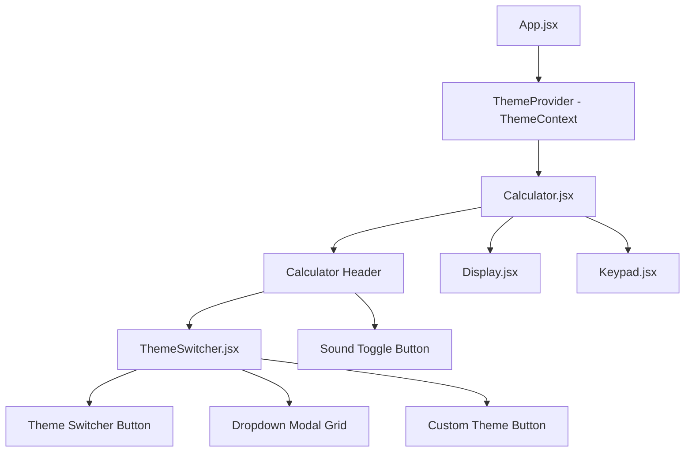
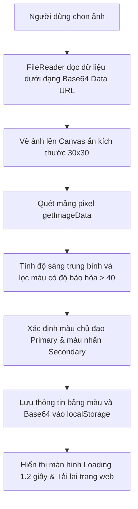

# BÁO CÁO TỔNG QUAN DỰ ÁN MÁY TÍNH ĐA GIAO DIỆN (REACT MULTI-THEME CALCULATOR)

---

## CHƯƠNG 1. GIỚI THIỆU ĐỀ TÀI

### 1.1. Lý do chọn đề tài
Máy tính bỏ túi là một công cụ tiện ích cơ bản và thiết yếu trên hầu hết các nền tảng thiết bị. Tuy nhiên, các ứng dụng máy tính hiện nay thường có giao diện đơn điệu và thiếu tính tương tác cá nhân hóa. Với sự phát triển của công nghệ web hiện đại, người dùng không chỉ yêu cầu tính chính xác cao trong tính toán mà còn đòi hỏi trải nghiệm trực quan sống động, giao diện phù hợp với sở thích cá nhân. 

Vì vậy, đề tài **"Xây dựng ứng dụng Máy tính đa giao diện tích hợp phân tích màu ảnh nền thông minh"** được lựa chọn nhằm giải quyết bài toán tối ưu hóa trải nghiệm người dùng (UX) thông qua việc kết hợp công nghệ web hiện đại và các thuật toán phân tích màu sắc trực tiếp trên trình duyệt.

### 1.2. Mục tiêu đề tài
- Xây dựng một ứng dụng máy tính bỏ túi chạy trên nền tảng web thực hiện đầy đủ các phép tính cơ bản.
- Thiết kế hệ thống đa giao diện (9 theme mặc định từ Retro, Glassmorphism, Neumorphism đến Gaming RGB).
- Phát triển tính năng giao diện tự tùy biến (Custom Theme) dựa trên hình ảnh tải lên từ thiết bị của người dùng:
  - Tự động trích xuất tông màu chủ đạo (Primary) và màu phụ (Secondary).
  - Tự động phân tích độ sáng để điều chỉnh màu chữ và viền nút tương phản, đảm bảo khả năng đọc (readability).
- Tích hợp hiệu ứng chuyển đổi mượt mà, phản hồi âm thanh (haptic sound) và khả năng thích ứng giao diện cao (Responsive).

### 1.3. Ý nghĩa thực tiễn
- Đối với lập trình viên: Nâng cao kỹ năng quản lý trạng thái phức tạp trong React (Sử dụng `useReducer` cho máy trạng thái máy tính), sử dụng các API HTML5 nâng cao như Canvas API, FileReader API, và làm quen với hệ thống thiết kế giao diện động (Dynamic CSS variables).
- Đối với người dùng: Mang lại một công cụ tính toán thú vị, đậm chất cá nhân và trực quan sinh động.

---

## CHƯƠNG 2. CƠ SỞ LÝ THUYẾT

### 2.1. Thư viện ReactJS (Phiên bản 19)
React là một thư viện JavaScript phổ biến để xây dựng giao diện người dùng dựa trên các thành phần (Component-based). Các đặc điểm lý thuyết được áp dụng trong dự án:
- **State và Props**: Quản lý dữ liệu động trong vòng đời của component.
- **Context API (`ThemeContext`)**: Truyền tải dữ liệu về theme đang kích hoạt toàn cục tới tất cả các component con mà không cần truyền thủ công qua từng cấp (prop drilling).
- **Hooks (`useState`, `useRef`, `useCallback`, `useEffect`)**: Cho phép sử dụng state và các tính năng khác của React trong functional components mà không cần viết class.
- **useReducer**: Quản lý trạng thái máy tính (Calculator State Machine). Việc tính toán có nhiều thao tác liên tục (nhập số, đổi dấu, bấm toán tử, lưu bộ nhớ tạm) nên sử dụng Reducer giúp luồng code xử lý logic rõ ràng, dễ bảo trì hơn so với sử dụng nhiều useState độc lập.

### 2.2. Công cụ build Vite (Phiên bản 8)
Vite là công cụ build thế hệ mới sở hữu tốc độ vượt trội nhờ tận dụng tính năng ES Modules nguyên bản trong các trình duyệt hiện đại kết hợp với trình biên dịch ESBuild bằng ngôn ngữ Go. Dự án sử dụng Vite giúp đẩy nhanh thời gian Hot Module Replacement (HMR) trong quá trình phát triển và tối ưu hóa dung lượng file đầu ra khi đóng gói (build).

### 2.3. Biến CSS (CSS Custom Properties)
Để thực hiện việc thay đổi giao diện động tức thì mà không cần tải lại file CSS mới, dự án sử dụng các biến CSS khai báo trong `:root` và các thuộc tính `data-theme`. Khi theme thay đổi, JavaScript chỉ cần thay đổi giá trị thuộc tính `data-theme` trên thẻ `<html>` hoặc cập nhật trực tiếp biến CSS thông qua:
```javascript
document.documentElement.style.setProperty('--variable-name', 'value');
```

### 2.4. Công nghệ phân tích hình ảnh phía Client (Canvas & FileReader)
- **FileReader API**: Giúp đọc tệp tin hình ảnh do người dùng tải lên và chuyển đổi thành chuỗi dữ liệu Base64 URL để đặt làm hình nền (`background-image`).
- **HTML5 Canvas API**: Tạo một bộ đệm canvas ẩn, vẽ hình ảnh thu nhỏ lên canvas đó để truy xuất dữ liệu màu của từng pixel qua hàm `getImageData()`. Từ đó thực hiện các công thức toán học tính toán độ sáng trung bình và chọn ra màu có độ bão hòa lớn nhất làm màu chủ đạo.

---

## CHƯƠNG 3. THIẾT KẾ HỆ THỐNG

### 3.1. Sơ đồ kiến trúc Component
Ứng dụng được chia tách thành các cấu trúc thành phần độc lập nhằm nâng cao tính tái sử dụng và dễ kiểm thử:



- `Display.jsx`: Hiển thị số liệu đầu vào hiện tại, các phép tính trước đó và toán tử đang hoạt động.
- `Keypad.jsx`: Bố trí lưới nút bấm (Grid layout 4x5) gồm các phím số, toán tử và phím điều hướng chức năng.
- `ThemeSwitcher.jsx`: Quản lý giao diện nút chọn theme dropdown, nút Custom bên ngoài và kích hoạt màn hình chờ load.
- `ThemeContext.js` & `ThemeContext.jsx`: Quản lý Context và Component Provider cung cấp trạng thái theme toàn cục.
- `useTheme.js`: Custom hook cung cấp quyền truy cập nhanh vào trạng thái theme.
- `themeUtils.js`: Thuật toán phân tích pixel Canvas và chỉnh sửa CSS Variables động.
- `audioUtils.js`: Tổng hợp tần số âm thanh click haptic sử dụng Web Audio API.

### 3.2. Quản lý trạng thái máy tính (Calculator Reducer)
Toàn bộ logic tính toán được tập trung tại `calculatorReducer.js` với các hành động (actions) chính:
- `ADD_DIGIT`: Thêm số vào màn hình hiển thị.
- `CHOOSE_OPERATION`: Chọn phép toán (+, -, *, /, %).
- `CLEAR`: Xóa toàn bộ dữ liệu (AC).
- `DELETE_DIGIT`: Xóa chữ số cuối cùng (DEL).
- `EVALUATE`: Thực hiện tính toán kết quả cuối cùng khi bấm dấu `=`.
- `TOGGLE_SIGN`: Đổi dấu âm/dương cho số hiện tại (+/-).

### 3.3. Thuật toán trích xuất bảng màu từ ảnh (Color Extraction Algorithm)
Thuật toán phân tích màu sắc hoạt động theo các bước tuần tự sau:



1. **Thu nhỏ ảnh**: Vẽ ảnh lên canvas kích thước `30x30` pixel (900 pixel tổng cộng) để tăng hiệu suất xử lý vòng lặp.
2. **Tính độ sáng (Brightness)**:
   $$\text{Độ sáng} = \frac{R \times 299 + G \times 587 + B \times 114}{1000}$$
   Nếu giá trị này $> 128$, ảnh nền được xác định là ảnh **Sáng (Light)**, ngược lại là ảnh **Tối (Dark)**. Hệ thống sẽ tự điều chỉnh màu chữ, viền nút cho tương phản phù hợp.
3. **Trích xuất màu sắc**: 
   - Quét qua mảng pixel và loại bỏ các màu xám, đen quá mức hoặc trắng quá mức (màu có độ bão hòa thấp).
   - Sắp xếp danh sách màu theo thứ tự độ bão hòa giảm dần. Màu bão hòa cao nhất được chọn làm màu chủ đạo cho các toán tử (`--btn-operator-bg`).
   - Lọc màu tiếp theo có khoảng cách màu lớn hơn 85 đơn vị trong không gian RGB Euclidean để làm màu nhấn cho các phím chức năng (`--btn-action-bg`).

---

## CHƯƠNG 4. KẾT QUẢ ĐẠT ĐƯỢC

### 4.1. Giao diện người dùng (UI/UX)
- Giao diện thiết kế theo phong cách hiện đại với hiệu ứng đổ bóng sắc nét và bo góc tinh tế.
- Các nút bấm được phản hồi nhanh (Active/Hover states) bằng các micro-animations nhẹ nhàng tăng tính sống động.
- Nút **Custom** đặt ở vị trí thuận tiện cạnh nút chuyển đổi giao diện chính. Khi hover qua nút Custom trong trạng thái Custom theme đang chạy, chữ trên nút tự động chuyển thành *"Đổi ảnh"* nhờ hiệu ứng CSS pseudo-element.

### 4.2. Trải nghiệm tải ảnh lên & Tự động reload
- Khi người dùng tải một bức ảnh nền mới lên từ máy tính:
  - Một màn hình đen mờ phủ toàn trang (Overlay) có chứa vòng xoay spinner và dòng chữ *"Đang phân tích màu sắc và thiết lập giao diện..."* xuất hiện lập tức.
  - Quá trình phân tích màu và ghi đè cấu hình vào `localStorage` diễn ra ngầm.
  - Sau khoảng trễ trực quan 1.2 giây, trang web tự động gọi lệnh reload. Khi trang được load lại, `ThemeContext` đọc cấu hình đã lưu và vẽ giao diện máy tính thích ứng hoàn toàn mới từ bức ảnh nền.

### 4.3. Hiệu suất ứng dụng
- Thời gian trích xuất màu sắc và phản hồi cực kỳ nhanh (dưới 10ms đối với canvas kích thước nhỏ).
- Ứng dụng chạy mượt mà trên tất cả các trình duyệt hiện đại (Chrome, Edge, Firefox, Safari) cả trên thiết bị di động và máy tính.

---

## CHƯƠNG 5. TỔNG KẾT

### 5.1. Ưu điểm
- Đạt tính thẩm mỹ cao, mang tính đột phá và cá nhân hóa sâu sắc so với các ứng dụng máy tính cơ bản.
- Trình tự phân tích màu sắc thực hiện hoàn toàn tại client-side giúp bảo mật dữ liệu ảnh của người dùng và tiết kiệm tài nguyên máy chủ.
- Trải nghiệm tải ảnh và tự động reload trang đem lại hiệu ứng phản hồi cực kỳ trực quan và sinh động.
- Cấu trúc thư mục sạch sẽ, tuân thủ chặt chẽ nguyên lý phát triển component của React.

### 5.2. Hạn chế
- Thuật toán phân tích màu sắc dựa trên SAT (Saturation) ở mức cơ bản, đôi khi chưa chọn được màu chuẩn xác nhất nếu bức ảnh có dải màu quá phức tạp hoặc ảnh đơn sắc xám.
- Chưa hỗ trợ lưu trữ lịch sử các phép tính đã thực hiện (History log).

### 5.3. Hướng phát triển đề tài
- Tích hợp thêm các thuật toán phân tích màu sắc nâng cao như **K-Means Clustering** để tìm màu chủ đạo chuẩn xác hơn.
- Mở rộng thêm bảng tính khoa học (Scientific Calculator) với các hàm phức tạp (sin, cos, tan, log...).
- Tích hợp thêm tính năng lưu lịch sử tính toán và cho phép sao chép nhanh kết quả vào khay nhớ tạm (Clipboard).
